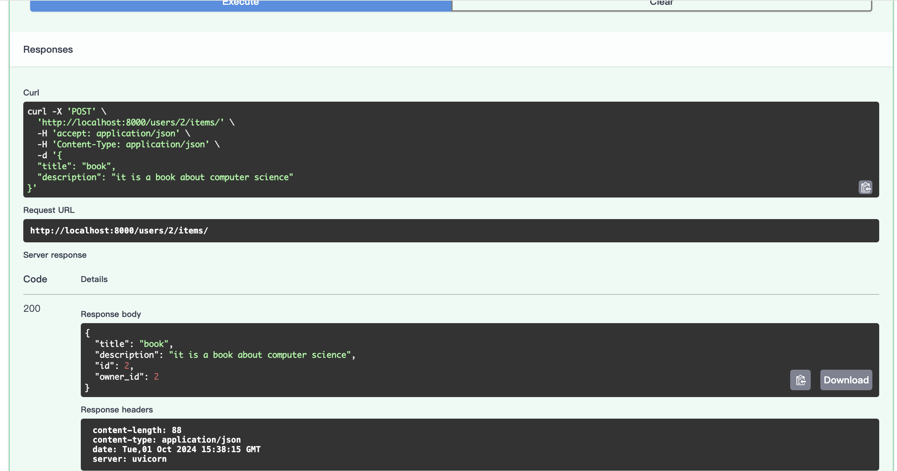

# CRUD FastAPI App with Docker

This is a simple CRUD (Create, Read, Update, Delete) API application built with FastAPI and SQLAlchemy. The app uses SQLite as the database and is containerized with Docker for easy deployment.

## Project Structure:
```bash
crud_project/
├── env/
├── sql_app/
│   ├── __init__.py
│   ├── crud.py
│   ├── database.py
│   ├── main.py
│   ├── models.py
│   └── schemas.py
├── requirements.txt
├── Dockerfile
└── LICENSE
```

## Features
- FastAPI for building the API
- SQLAlchemy for database ORM
- SQLite as the database
- Docker for containerization
- Pydantic for data validation and serialization

## Prerequisites
Before you begin, ensure you have the following installed on your machine:
- Python 3.11.5+
- Docker

## Installation and Setup
### 1. Clone the Repository
```bash
git clone https://github.com/xulitong22/crud_project.git
cd crud_project
```
### 2. Install Dependencies
Install the required Python packages using pip:
```bash
pip install -r requirements.txt
```

### 3. Run the Application Locally (Without Docker)
 To test the app locally before using Docker, you can run:
```bash
uvicorn sql_app.main:app --reload
```
Then navigate to http://127.0.0.1:8000/docs to see the interactive API documentation generated by FastAPI (Swagger UI).

## Running the Application with Docker
### 1. Build the Docker Image
To build the Docker image:
```bash
docker build -t fastapi-crud-app .
```

### 2. Run the Docker Container
Once the image is built, you can run the container:
```bash
docker run -d -p 8000:8000 fastapi-crud-app
```
This will run the FastAPI app in a Docker container, and the API will be available at http://localhost:8000.

### 3. Stop the Docker Container
To stop the running container:
- List all running containers:
```bash
docker ps
```
- Stop the container:
```bash
docker stop <container_id>
```

## Endpoints
Here are some available API endpoints:

POST /users/: Create a new user.
GET /users/: Get a list of users.
GET /users/{user_id}: Get a user by ID.
POST /users/{user_id}/items/: Create an item for a user.
GET /items/: Get a list of items.

## API Documentation

Here are some screenshot of the API documentation interface:





## License
This project is licensed under the MIT License. See the LICENSE file for more information.